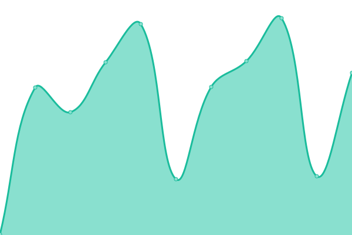
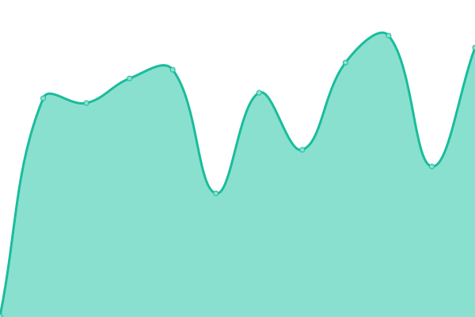
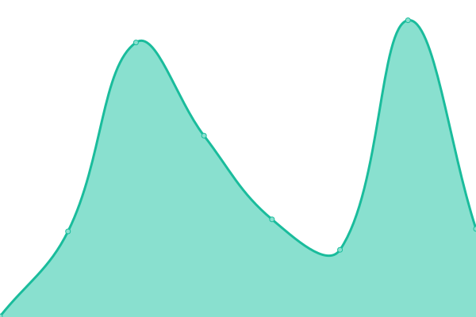
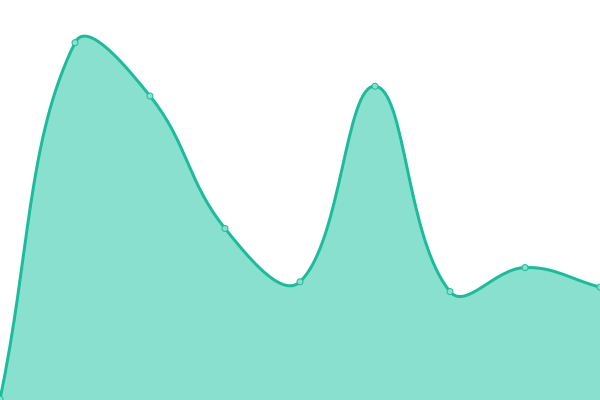
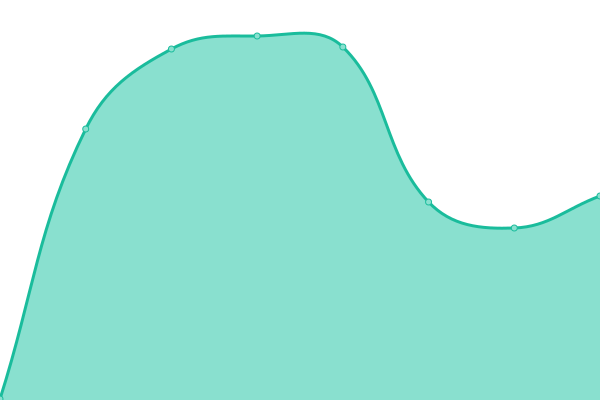

# [📈 Live Status](https://Certegy-Payment-Solutions.github.io/cashline.uptime.monitor): <!--live status--> **🟩 All systems operational**

This repository contains the open-source uptime monitor and status page for [Certegy-Payment-Solutions](https://Certegy-Payment-Solutions.github.io/cashline.uptime.monitor), powered by [Upptime](https://github.com/upptime/upptime).

<!--start: status pages-->
<!-- This summary is generated by Upptime (https://github.com/upptime/upptime) -->
<!-- Do not edit this manually, your changes will be overwritten -->
<!-- prettier-ignore -->
| URL | Status | History | Response Time | Uptime |
| --- | ------ | ------- | ------------- | ------ |
|  [Cashline Tomcat - PROD](https://certegycashline.com/) | 🟩 Up | [cashline-tomcat-prod.yml](https://github.com/Certegy-Payment-Solutions/cashline.uptime.monitor/commits/HEAD/history/cashline-tomcat-prod.yml) | 

 280ms
     
 | 

<a href="https://Certegy-Payment-Solutions.github.io/cashline.uptime.monitor/history/cashline-tomcat-prod">100.00%</a>
    

|  [Cashline Java - PROD](https://cashline.certegy.com/health) | 🟩 Up | [cashline-java-prod.yml](https://github.com/Certegy-Payment-Solutions/cashline.uptime.monitor/commits/HEAD/history/cashline-java-prod.yml) | 

 1053ms
     
 | 

<a href="https://Certegy-Payment-Solutions.github.io/cashline.uptime.monitor/history/cashline-java-prod">100.00%</a>
    

|  [Cashline Tomcat - CCE](https://cce.certegycashline.com/) | 🟩 Up | [cashline-tomcat-cce.yml](https://github.com/Certegy-Payment-Solutions/cashline.uptime.monitor/commits/HEAD/history/cashline-tomcat-cce.yml) | 

 320ms
     
 | 

<a href="https://Certegy-Payment-Solutions.github.io/cashline.uptime.monitor/history/cashline-tomcat-cce">100.00%</a>
    

|  [Cashline Java - CCE](https://cce.cashline.certegy.com/health) | 🟩 Up | [cashline-java-cce.yml](https://github.com/Certegy-Payment-Solutions/cashline.uptime.monitor/commits/HEAD/history/cashline-java-cce.yml) | 

 810ms
     
 | 

<a href="https://Certegy-Payment-Solutions.github.io/cashline.uptime.monitor/history/cashline-java-cce">100.00%</a>
    

|  [Cashline Tomcat - UAT](https://uat.certegycashline.com/) | 🟩 Up | [cashline-tomcat-uat.yml](https://github.com/Certegy-Payment-Solutions/cashline.uptime.monitor/commits/HEAD/history/cashline-tomcat-uat.yml) | 

 242ms
     
 | 

<a href="https://Certegy-Payment-Solutions.github.io/cashline.uptime.monitor/history/cashline-tomcat-uat">100.00%</a>
    

|  [Cashline Java - UAT](https://uat.cashline.certegy.com/health) | 🟩 Up | [cashline-java-uat.yml](https://github.com/Certegy-Payment-Solutions/cashline.uptime.monitor/commits/HEAD/history/cashline-java-uat.yml) | 

 818ms
     
 | 

<a href="https://Certegy-Payment-Solutions.github.io/cashline.uptime.monitor/history/cashline-java-uat">100.00%</a>
    

|  [Cashline Tomcat - QA](https://qat.certegycashline.com/) | 🟩 Up | [cashline-tomcat-qa.yml](https://github.com/Certegy-Payment-Solutions/cashline.uptime.monitor/commits/HEAD/history/cashline-tomcat-qa.yml) | 

 297ms
     
 | 

<a href="https://Certegy-Payment-Solutions.github.io/cashline.uptime.monitor/history/cashline-tomcat-qa">100.00%</a>
    

|  [Cashline Java - QA](https://qat.cashline.certegy.com/health) | 🟩 Up | [cashline-java-qa.yml](https://github.com/Certegy-Payment-Solutions/cashline.uptime.monitor/commits/HEAD/history/cashline-java-qa.yml) | 

 791ms
     
 | 

<a href="https://Certegy-Payment-Solutions.github.io/cashline.uptime.monitor/history/cashline-java-qa">100.00%</a>
    

|  [Cashline Tomcat - Dev](https://dev.certegycashline.com/) | 🟩 Up | [cashline-tomcat-dev.yml](https://github.com/Certegy-Payment-Solutions/cashline.uptime.monitor/commits/HEAD/history/cashline-tomcat-dev.yml) | 

 250ms
     
 | 

<a href="https://Certegy-Payment-Solutions.github.io/cashline.uptime.monitor/history/cashline-tomcat-dev">100.00%</a>
    

|  [Cashline Java - Dev](https://dev.cashline.certegy.com/health) | 🟩 Up | [cashline-java-dev.yml](https://github.com/Certegy-Payment-Solutions/cashline.uptime.monitor/commits/HEAD/history/cashline-java-dev.yml) | 

 832ms
     
 | 

<a href="https://Certegy-Payment-Solutions.github.io/cashline.uptime.monitor/history/cashline-java-dev">100.00%</a>
    

|  [BNPL Consumer Portal - UAT](https://bnpl-consumer-portal-uat.certegy.com) | 🟩 Up | [bnpl-consumer-portal-uat.yml](https://github.com/Certegy-Payment-Solutions/cashline.uptime.monitor/commits/HEAD/history/bnpl-consumer-portal-uat.yml) | 

 86ms
     
 | 

<a href="https://Certegy-Payment-Solutions.github.io/cashline.uptime.monitor/history/bnpl-consumer-portal-uat">100.00%</a>
    

|  [BNPL Consumer Portal - DEV](https://bnpl-consumer-portal-dev.certegy.com) | 🟩 Up | [bnpl-consumer-portal-dev.yml](https://github.com/Certegy-Payment-Solutions/cashline.uptime.monitor/commits/HEAD/history/bnpl-consumer-portal-dev.yml) | 

 101ms
     
 | 

<a href="https://Certegy-Payment-Solutions.github.io/cashline.uptime.monitor/history/bnpl-consumer-portal-dev">100.00%</a>
    

|  [BNPL Consumer Portal - Prod](https://dashboard.certegy.com) | 🟩 Up | [bnpl-consumer-portal-prod.yml](https://github.com/Certegy-Payment-Solutions/cashline.uptime.monitor/commits/HEAD/history/bnpl-consumer-portal-prod.yml) | 

 70ms
     
 | 

<a href="https://Certegy-Payment-Solutions.github.io/cashline.uptime.monitor/history/bnpl-consumer-portal-prod">100.00%</a>
    

|  [Bankpay - Prod](https://bankpay.certegy.com/health) | 🟩 Up | [bankpay-prod.yml](https://github.com/Certegy-Payment-Solutions/cashline.uptime.monitor/commits/HEAD/history/bankpay-prod.yml) | 

 373ms
     
 | 

<a href="https://Certegy-Payment-Solutions.github.io/cashline.uptime.monitor/history/bankpay-prod">100.00%</a>
    

|  [Bankpay - CCE](https://cce.bankpay.certegy.com/health) | 🟩 Up | [bankpay-cce.yml](https://github.com/Certegy-Payment-Solutions/cashline.uptime.monitor/commits/HEAD/history/bankpay-cce.yml) | 

 372ms
     
 | 

<a href="https://Certegy-Payment-Solutions.github.io/cashline.uptime.monitor/history/bankpay-cce">93.80%</a>
    

|  [Bankpay - QA](https://qa.bankpay.certegy.com/health) | 🟩 Up | [bankpay-qa.yml](https://github.com/Certegy-Payment-Solutions/cashline.uptime.monitor/commits/HEAD/history/bankpay-qa.yml) | 

 385ms
     
 | 

<a href="https://Certegy-Payment-Solutions.github.io/cashline.uptime.monitor/history/bankpay-qa">95.25%</a>
    

<!--end: status pages-->

[**Visit our status website →**](https://Certegy-Payment-Solutions.github.io/cashline.uptime.monitor)

## 📄 License

- Powered by: [Upptime](https://github.com/upptime/upptime)
- Code: [MIT](./LICENSE) © [Certegy-Payment-Solutions](https://Certegy-Payment-Solutions.github.io/cashline.uptime.tomcat)
- Data in the `./history` directory: [Open Database License](https://opendatacommons.org/licenses/odbl/1-0/)
